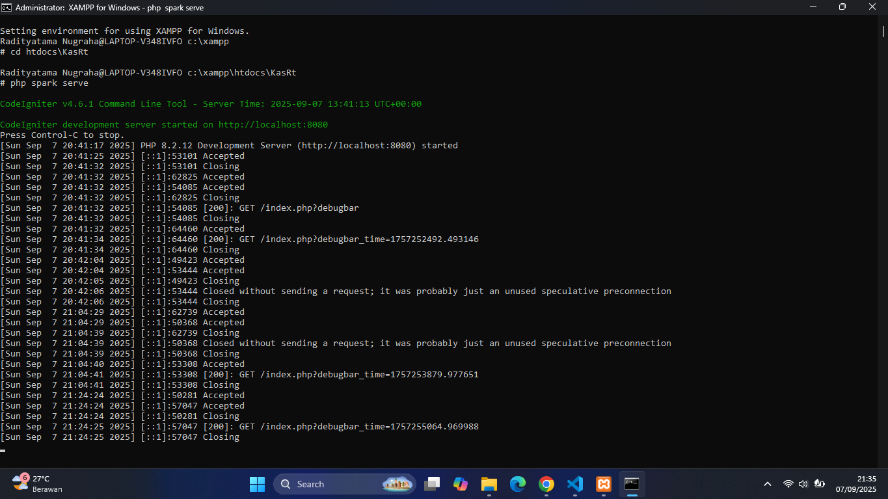
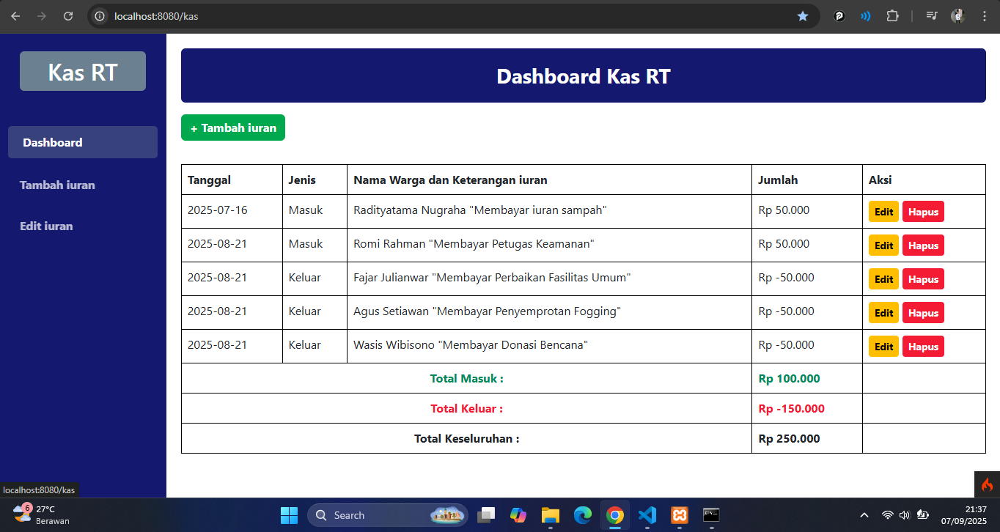
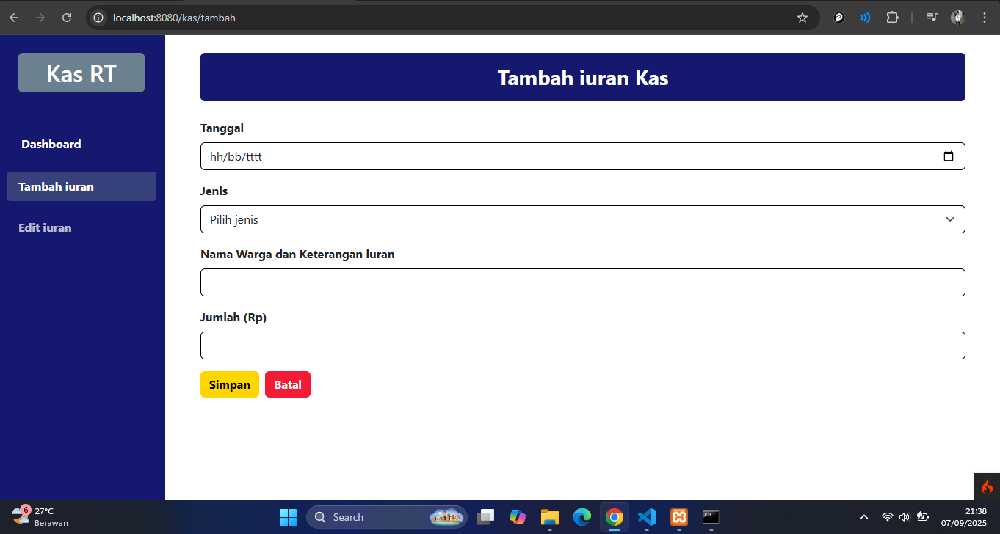
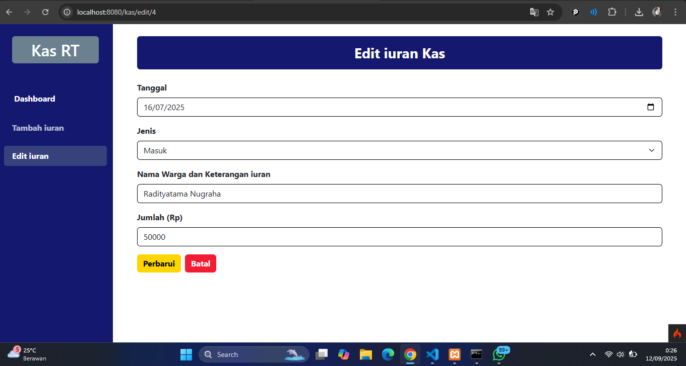

# Project Lanjutan Manajemen Kas Rt &nbsp;&nbsp; 

## Cara Menjalankan Website Menggunakan Shell di XAMPP


## Code Halaman Dashboard Kas Rt
```php
<?= $this->extend('layout') ?>
<?= $this->section('content') ?>

<style>
    .btn-tambah {
        background-color: #28a745;
        color: white;
        font-weight: bold;
        border: none;
        transition: all 0.2s ease;
    }

    .btn-tambah:hover {
        background-color: #218838;
        transform: scale(1.05);
        box-shadow: 0 0 10px rgba(40, 167, 69, 0.5);
    }

    .btn-tambah:active {
        transform: scale(0.95);
        background-color: #1e7e34;
    }

    .btn-edit {
        background-color: #ffc107;
        color: black;
        font-weight: bold;
        border: none;
        transition: all 0.2s ease;
    }

    .btn-edit:hover {
        background-color: #e0a800;
        transform: scale(1.05);
        box-shadow: 0 0 10px rgba(255, 193, 7, 0.5);
    }

    .btn-edit:active {
        transform: scale(0.95);
        background-color: #d39e00;
    }

    .btn-hapus {
        background-color: #dc3545;
        color: white;
        font-weight: bold;
        border: none;
        transition: all 0.2s ease;
    }

    .btn-hapus:hover {
        background-color: #c82333;
        transform: scale(1.05);
        box-shadow: 0 0 10px rgba(220, 53, 69, 0.5);
    }

    .btn-hapus:active {
        transform: scale(0.95);
        background-color: #bd2130;
    }
</style>

<div class="mb-3">
    <div class="text-white rounded text-center fw-bold py-3 px-4 mb-3 fs-3"
        style="width: 100%; background-color: #191970;">
        Dashboard Kas RT
    </div>

    <a href="/kas/tambah" class="btn btn-tambah mb-3">+ Tambah iuran</a>
</div>

<table class="table table-bordered">
    <tr>
        <th>Tanggal</th>
        <th>Jenis</th>
        <th>Nama Warga dan Keterangan iuran</th>
        <th>Jumlah</th>
        <th>Aksi</th>
    </tr>
    <?php foreach ($kas as $row): ?>
        <tr>
            <td><?= $row['tanggal'] ?></td>
            <td><?= ucfirst($row['jenis']) ?></td>
            <td><?= $row['keterangan'] ?></td>
            <td>Rp <?= number_format($row['jumlah'], 0, ',', '.') ?></td>
            <td>
                <a href="/kas/edit/<?= $row['id'] ?>" class="btn btn-edit btn-sm">Edit</a>
                <a href="/kas/hapus/<?= $row['id'] ?>" onclick="return confirm('Yakin?')" class="btn btn-hapus btn-sm">Hapus</a>
            </td>
        </tr>
    <?php endforeach ?>

    <tr>
        <td colspan="3" class="text-center fw-bold text-success">Total Masuk :</td>
        <td class="fw-bold text-success">Rp <?= number_format($totalMasuk ?? 0, 0, ',', '.') ?></td>
        <td></td>
    </tr>

    <tr>
        <td colspan="3" class="text-center fw-bold text-danger">Total Keluar :</td>
        <td class="fw-bold text-danger">Rp <?= number_format($totalKeluar ?? 0, 0, ',', '.') ?></td>
        <td></td>
    </tr>

    <tr>
        <td colspan="3" class="text-center fw-bold">Total Keseluruhan :</td>
        <td class="fw-bold">Rp <?= number_format($total ?? 0, 0, ',', '.') ?></td>
        <td></td>
    </tr>
</table>
</div>

<?= $this->endSection() ?>
```

## Halaman Dashboard Kas Rt


## Code Halaman Tambah Iuran Kas
```php
<?= $this->extend('layout') ?>
<?= $this->section('content') ?>

<style>
    input.form-control,
    select.form-select,
    textarea.form-control {
        border: 1px solid #000 !important;
        box-shadow: none !important;
    }

    .btn-simpan {
        background-color: #FFD700;
        color: black;
        border: none;
        transition: all 0.2s ease;
    }

    .btn-simpan:hover {
        background-color: #FFC107;
        transform: scale(1.03);
    }

    .btn-simpan:active {
        background-color: #E0B800;
        transform: scale(0.97);
    }

    .btn-batal {
        background-color: #DC3545;
        color: white;
        border: none;
        transition: all 0.2s ease;
    }

    .btn-batal:hover {
        background-color: #C82333;
        transform: scale(1.03);
    }

    .btn-batal:active {
        background-color: #A71D2A;
        transform: scale(0.97);
    }
</style>

<div class="container mt-1">
    <div class="text-white rounded py-3 px-4 mb-4 mx-3 text-center" style="background-color: #191970;">
        <h3 class="mb-0"><strong>Tambah iuran Kas</strong></h3>
    </div>

    <form action="/kas/simpan" method="post" class="mx-3">
        <div class="mb-3">
            <label for="tanggal" class="form-label fw-bold">Tanggal</label>
            <input type="date" name="tanggal" id="tanggal" class="form-control" required>
        </div>
        <div class="mb-3">
            <label class="form-label fw-bold">Jenis</label>
            <select name="jenis" class="form-select" required>
                <option value="" disabled selected>Pilih jenis</option>
                <option value="masuk">Masuk</option>
                <option value="keluar">Keluar</option>
            </select>
        </div>
        <div class="mb-3">
            <label for="keterangan" class="form-label fw-bold">Nama Warga dan Keterangan iuran</label>
            <input type="text" name="keterangan" id="keterangan" class="form-control">
        </div>
        <div class="mb-3">
            <label for="jumlah" class="form-label fw-bold">Jumlah (Rp)</label>
            <input type="number" name="jumlah" id="jumlah" class="form-control" required>
        </div>
        <div class="d-flex gap-2">
            <button type="submit" class="btn fw-bold btn-simpan">
                Simpan
            </button>
            <a href="/kas" class="btn fw-bold btn-batal">
                Batal
            </a>
        </div>
    </form>
</div>

<?= $this->endSection() ?>
```

## Halaman Tambah Iuran Kas 


## Code Halaman Edit Iuran Kas
```php
<?= $this->extend('layout') ?>
<?= $this->section('content') ?>

<style>
    input.form-control,
    select.form-select,
    textarea.form-control {
        border: 1px solid #000 !important;
        box-shadow: none !important;
    }

    .btn-simpan {
        background-color: #FFD700;
        color: black;
        border: none;
        transition: all 0.2s ease;
    }

    .btn-simpan:hover {
        background-color: #FFC107;
        transform: scale(1.03);
    }

    .btn-simpan:active {
        background-color: #E0B800;
        transform: scale(0.97);
    }

    .btn-batal {
        background-color: #DC3545;
        color: white;
        border: none;
        transition: all 0.2s ease;
    }

    .btn-batal:hover {
        background-color: #C82333;
        transform: scale(1.03);
    }

    .btn-batal:active {
        background-color: #A71D2A;
        transform: scale(0.97);
    }
</style>

<div class="container mt-1">
    <div class="text-white rounded py-3 px-4 mb-4 mx-3 text-center" style="background-color: #191970;">
        <h3 class="mb-0"><strong>Edit iuran Kas</strong></h3>
    </div>

    <form action="/kas/update/<?= $kas['id'] ?>" method="post" class="mx-3">
        <div class="mb-3">
            <label for="tanggal" class="form-label fw-bold">Tanggal</label>
            <input type="date" name="tanggal" id="tanggal" class="form-control" value="<?= $kas['tanggal'] ?>" required>
        </div>

        <div class="mb-3">
            <label class="form-label fw-bold">Jenis</label>
            <select name="jenis" class="form-select" required>
                <option value="masuk" <?= $kas['jenis'] == 'masuk' ? 'selected' : '' ?>>Masuk</option>
                <option value="keluar" <?= $kas['jenis'] == 'keluar' ? 'selected' : '' ?>>Keluar</option>
            </select>
        </div>

        <div class="mb-3">
            <label for="keterangan" class="form-label fw-bold">Nama Warga dan Keterangan iuran</label>
            <input type="text" name="keterangan" id="keterangan" class="form-control" value="<?= $kas['keterangan'] ?>">
        </div>

        <div class="mb-3">
            <label for="jumlah" class="form-label fw-bold">Jumlah (Rp)</label>
            <input type="number" name="jumlah" id="jumlah" class="form-control" value="<?= $kas['jumlah'] ?>" required>
        </div>

        <div class="d-flex gap-2">
            <button type="submit" class="btn fw-bold btn-simpan">
                Perbarui
            </button>
            <a href="/kas" class="btn fw-bold btn-batal">
                Batal
            </a>
        </div>
    </form>
</div>

<?= $this->endSection() ?>
```

## Halaman Edit Iuran Kas 



